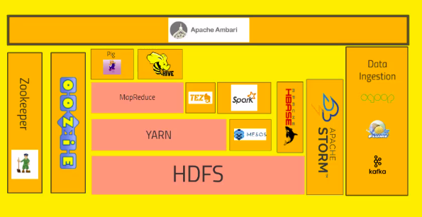

# Hadoop Architecture

- HDFS(Hadoop distributed file systems): The file system
- YARN(Yet another resource negotiator): What gets to run when what nodes are available and stuff.
- Map-Reduce: A programming model or metaphore that allows yout to process your data accross the cluster(Java and python).
- Pig : Sits on top of mapreduece, it is a high level programing API, that looks like sequel.
- Hive: Its similar to pig but looks more directly like a  sequel DB.
- Ambari: It sits on top of everything and mainly helps you visualize stuff and import stuff.(Used by horton wroks)
- Mesos: Similar to YARN(not hadoop proper)
- Spark: (MOST EXCITING!!) Same level as map-reduce.(pyton, java or SCALA). It can handle sequel queries, handel ML accross clusters and helps in streaming data in realtime.
- Tez : Similar to spark. works better in conjunction for hive than mapreduce.
- HBASE: No sequel DB, it can expose the data that is stored in the cluster.
- Apache Storm:  A way of proecssing streaming data.(realtime).
- OOZIE: A way of scheduling jobs on the cluster.
- Zookeeper: A technology for coordinating everything on the cluster.
- Data Ingestion:
    - Sqoop: used to connect your SQL DB or no sql DB or any local DB to HDFS
    - KAFKA: collects data of any form from a cluster of PCs or any form of webservers and broadcast that into the hadoop clusters