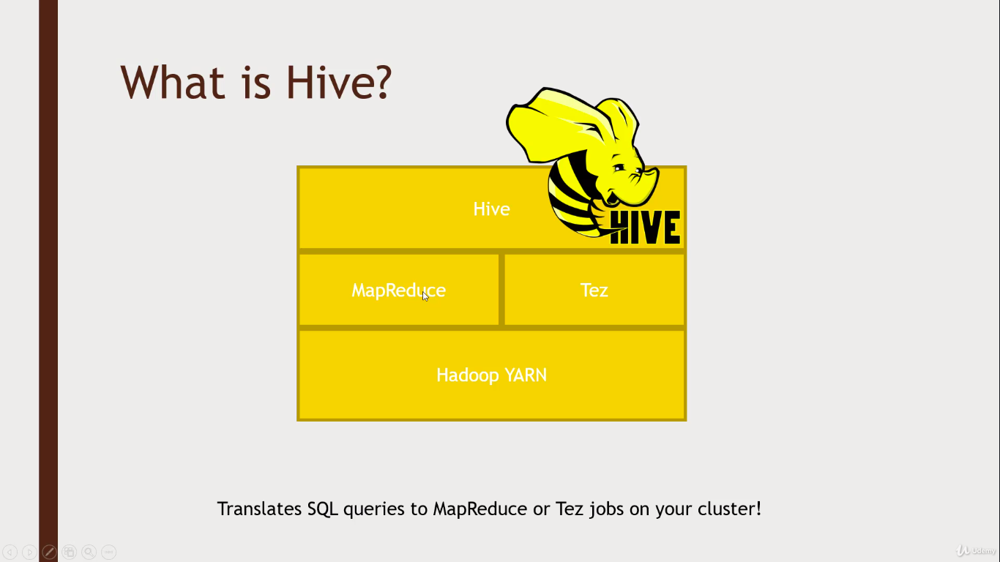

# Hive


Hive is a architecture that lets you run sequel queries accross entire Cluster. It works by translating your SQL into map-reduce or tez commands.

### Advantages of hive:
- Familier SQL syntaxes
- Interactive
- Scalable (Most appropriate for Big data)
- UDFs

### Disadvantages of hive:
- High latency(cannot be used for online transactions in realtime)
- Stores data in a denormalised fasion(Does not have foreign keys concept)
- SQL has its limits (More complex queries can be done with Pig or spark)
- No record-level updates, inserts and deletes.

The variation of SQL used in hive is the HiveQL, it is pretty much the same thing as MySql with some extensions ( Eg: "view"..can store the results of a query in a "view", which subsequent queries can use as a table )


Eg: Top rated movies
```
CREATE view IF NOT EXISTS topMovieIDs AS
SELECT movieID, count(movieID) as ratingCount
FROM ratings
GROUP BY movieID
ORDER BY ratingCount DESC;

SELECT n.title ratingCount
FROM topMovieIDs t JOIN names n ON t.movieID = n.movieID;
```
```
DROP view topMovieIDs
```