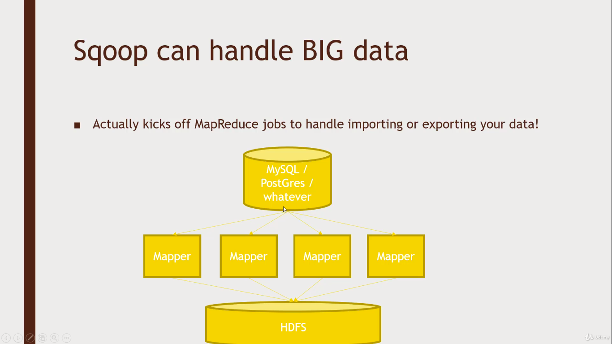

# Sqoop



- Importing Mysql,Postgres or any DB into the HDFS

``` sqoop import --connect <a database instance and the location> --driver <driver details (to prevent errors)[optional]> --table <table name> -m <number of matters [optional]>```  

- Importing DB directly into Hive 

``` sqoop import --connect <a database instance and the location> --driver <driver details to prevent errors[optional]> --table <table name> --hive-import```  

- Exporting DB from Hive to DB 

<i>Remember: The table has to be already created in the MYsql or Postgres in the local system</i>

``` sqoop import --connect <a database instance and the location> --driver <driver details (to prevent errors)[optional]> --table exported <table name> --export-dir <locationfor the table> --input-fields-terminated-by '\0001' ``` 


Eg: Import data from Mysql to HDFS

``` 
sqoop import --connect jdbc:mysql://localhost/movielens --driver com.mysql.jdbc.Driver --table movies
```