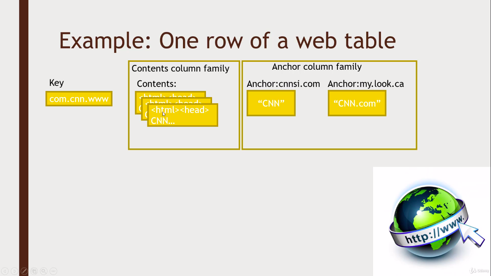

# HBASE

Built on HDFS (Built with Google's BigTable Architecture idea)  
  
There is no Query language, only CRUD APIs  
- CRUD: Create, Read, Update, Delete

### Architecture:

It is split up into automatically adapting different region servers depending on ranges of keys.

The queris are sent to the Region servers directly. And HMaster keeps all the metadata which inturn depends on the Zookeeper 

### HBase data model

- A ROW is referenced by a unique KEY
- Each ROW has some small number of COLUMN FAMILIES
- Each COLUMN FAMILIES has many arbitary COLUMNS
- Eah CELL can have many VERSIONS with given timestamp
- Sparse data is A-OK - missing columns in a row consume no storage.

### Access HBase
- HBase shell
- Java API
    - Wrappers for python, scala, etc
- Spark, Hive, Pig
- REST service
- Thrift service
- Avro service