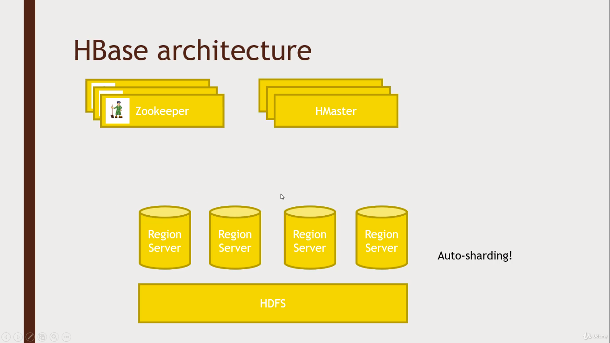

# HBASE

Built on HDFS (Built with Google's BigTable Architecture idea)  
  
There is no Query language, only CRUD APIs  
- CRUD: Create, Read, Update, Delete



### Architecture:

It is split up into automatically adapting different region servers depending on ranges of keys.

The queris are sent to the Region servers directly. And HMaster keeps all the metadata which inturn depends on the Zookeeper 

### HBase data model


- A ROW is referenced by a unique KEY
- Each ROW has some small number of COLUMN FAMILIES
- Each COLUMN FAMILIES has many arbitary COLUMNS
- Eah CELL can have many VERSIONS with given timestamp
- Sparse data is A-OK - missing columns in a row consume no storage.

### Access HBase

- hbase shell
- Java API
    - Wrappers for python, scala, etc
- Spark, Hive, Pig
- REST service
- Thrift service
- Avro service

### Integrating Pig with HBase  
 
For moving the huge amount of data in the HDFS to HBase (Also can be done using import TSV)

- Must create HBase table ahead of time
- Your relation must have a unique key as its first columa, followed by subsequent columns as you want them saved in HBase.
- USING clause allows you to STORE into an HBase table
- Can work at scale - HBase in transactional on rows

The code related to this is in ```hbase.pig```  
Execute it in the hortonBox framework's shell with ```pig hbase.pig```