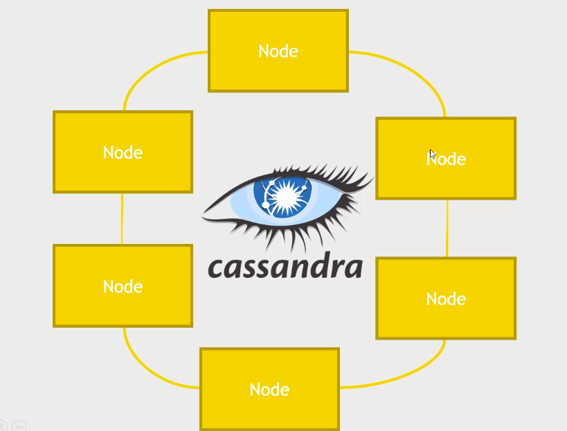

# Cassandra

No single point of failure

- Unlike HBase there is no master node at all - every node runs exactly the same software and performs the same functions
- Data model is similar to HBase
- It is a non relational, but has a limited CQL quely language as its interface.

### Cassandra's Design Choices

- The CAP theorem says you can only have 2 out of 3: consistancy, availability, partition-tolerance.  

<i> And partition tolernace is a requirement with "big data", so we only get to choose between C and A</i>

- HBase and mongoDB favours Consistancy

- MySQL and oracle favours Consistancy and Availability, so scaling these across the cluster is a pain.
 
- Cassandra favours availability over consistancy
    - It is "eventually consistent"
    - But we can specify our consistency requirements as part of your requests. So really it is "tunable consistency".

### Cassandra architecture

It uses gossip protocol so that every node in he cluster is communicating with each other and decides among themself about who is responsible for what part of the data. So everynode in the cluster is running the exact same software and same functions.

And the client directly talks to the nodes.

You can specify the consistancy by telling that you would accept the output if 3 out of six nodes agree on the same value.

If you really dont care about the consistancy you will accept the output that was first returned from the cluster. In this method the Availability is high but the consistancy is low

