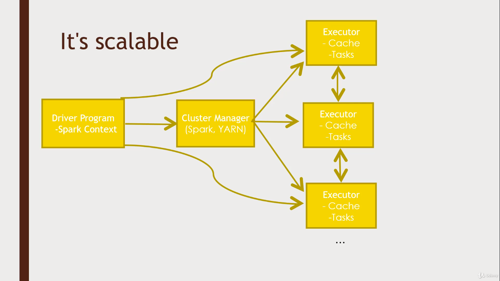

# Spark

A fast and general engine for large-scale data processing

- Higly sclable

Each executor(node) is respomsible for a executive process(task) and also maintains cache. The Cache is the key to the performance unlike other disc based solutions that hits HDFS all the time spark is a memeory based solution. An other factor responsible for the speed is the directed acyclic graph.

(A directed acyclic graph helps in working on the problems from backwords which helps the compute engine in finding the fastest way to get there (similar to Tez with PIG))

### Inbuilt libraries in Spark:
- Spark streaming
- Spark SQL
- MLlib
- GraphX
